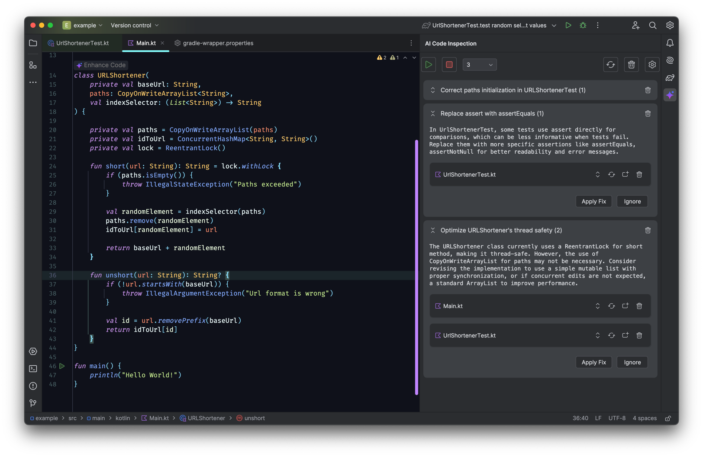
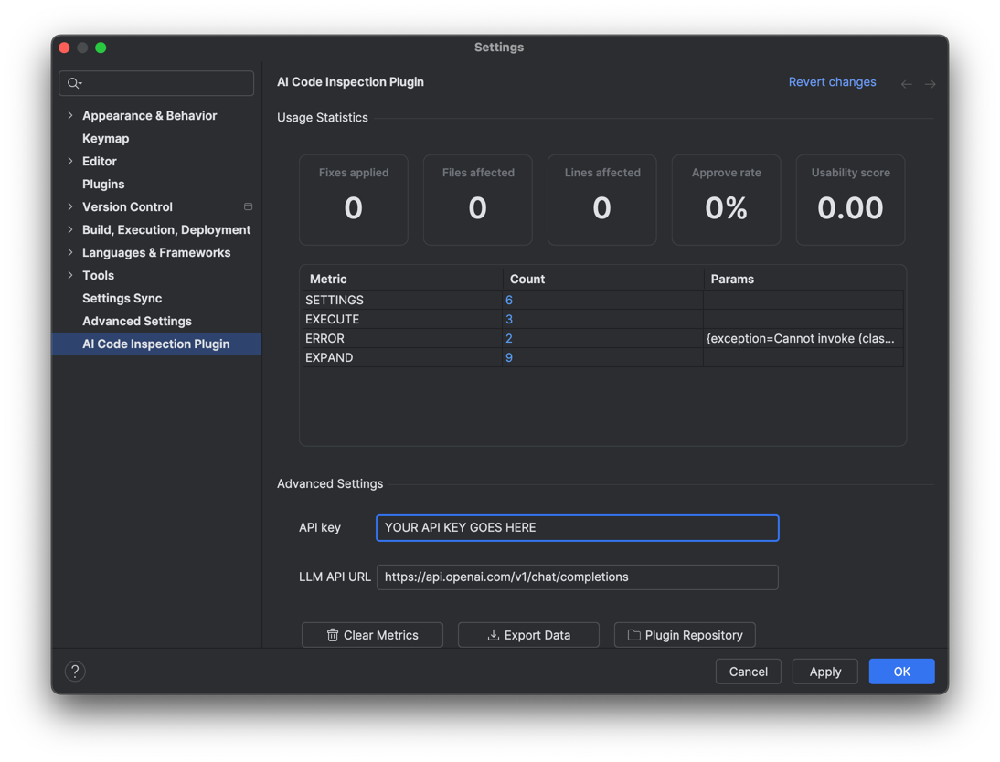

# jetbrains-ai-code-inspection-plugin

## Inspection Analyzing Plugin

<!-- Plugin description -->
This plugin helps you tackle technical debt by running deep inspections across your project and fixing code smells with the help of AI. It scans your entire codebase, identifies the most problematic areas, and uses LLM-powered suggestions to apply meaningful fixes—all in one flow.

## How does this work?
Behind the scenes, it leverages a smart, efficient inspection engine that crawls the file system and PSI tree to detect complex, hard-to-maintain code. Once inspections are collected, the plugin builds a prompt enriched with project context and sends it to an LLM (via OpenAI). The response is then turned into actionable fixes applied across relevant files. 

## How does this work?

* Cross-file inspection results that highlight deeply nested or smelly logic

* Clear, AI-generated fix suggestions tailored to each inspection

* One-click quick-fix UI to preview and apply changes

* A progress dialog to follow the inspection → fix pipeline

* Automatic fix application to all impacted files

* Background metrics collection to analyze inspection usage and effectiveness

## How to use it?

1. Open your project in IntelliJ.

2. Right-click on the project root and select "Run AI Inspection Analysis".

3. The plugin will scan your codebase and list all detected issues across files.

4. For each inspection, you’ll see the description and a "Fix with AI" option.

5. Click it. The plugin prepares a prompt, sends it to the LLM, and shows a progress dialog.

6. Once the fix is ready, it's applied to all affected files automatically.

7. You can review changes, accept, or revert them just like with regular code suggestions.

<!-- Plugin description end -->
